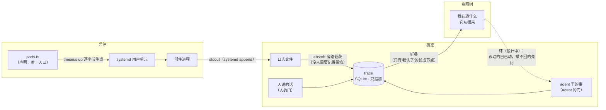

<p align="center">
  
</p>

# Theseus V2

**一个人的 AI 操作系统，自顶向下重建。**

像忒修斯之船：板子在航行中一块块换掉，而船必须始终是那条船——系统在运行中被替换、被修正、被长出新的部分，而"我在追什么、发生过什么、为什么"这三个问题在任何时刻都答得上来。

> 全部文档以中文写成，这是这个项目的工作语言。
> Documentation is in Chinese — the working language of this project.

---

## 这是什么

一个个人 AI OS 的地基，由四块构成，每块对应一段编号连续的用户用例（U1–U24）：

| 模块 | 管什么 | 用例 | 状态 |
|---|---|---|---|
| **启停** (lifecycle) | 部件进程的生死：声明式启停、诚实的状态、双向对账 | U1–U6 | ✅ 实现 + 验收 |
| **痕迹** (trace) | 留下的那份东西：因果链、三种起点、决定必须带依据 | U7–U14 | ✅ 实现 + 验收（U13/U14 迁移轮除外） |
| **意图树** (intent) | 我在追什么、它从哪来：树是从痕迹里折叠出来的，不另存 | U15–U19 | 🔨 需求 / 设计 / 验收规格已定，实现中 |
| **环** (loop) | 事情发生 → 有东西看见 → 动手 → 又留痕：把三块连起来 | U20–U24 | 📋 需求已定（含反面场景） |

每一块都是同一条流水线：**需求**（`docs/requirements/`，一个技术名词都不出现）→ **设计**（`docs/design/`，每处写明用的是谁的成熟做法）→ **验收**（`docs/acceptance/`，断言"人的处境"而不是"机制的状态"）→ 实现 → **变异锁**（`test/mutation-lock.mjs`，故意弄坏每条关键性质，确认对应测试真的会红）。

## 第一原则：先找成熟解法，再考虑自己造

这个系统应该**只有极少部分值得创新**（[`docs/PRINCIPLES.md`](docs/PRINCIPLES.md)）。这条原则在项目里每次听它的都赢、不听的都栽：

| 问题 | 一开始想自己造 | 换成谁的做法 | 结果 |
|---|---|---|---|
| 进程的生死 | 564 行看护程序 | **systemd** | 代码 564 → 298 行，第 1 版里最难的六条需求**不是被解决的，是消失了** |
| 并发命令 | 内存里的版本号护栏 | **文件锁**（`O_EXCL` + tmpfs，dpkg/git 的做法） | 跨进程真的有效，比原方案更强 |
| 多余的东西谁来删 | 按名字前缀删 | **Terraform/K8s 的答案**：只删自己造的 | "连旧系统一起删掉"这个错**从根上不可能犯** |
| 痕迹用什么存 | 自己定文件格式 | **SQLite** | 不丢（事务）、不重（唯一约束）、追因果（递归查询）、翻得动（索引） |

自己造的部分被单独点名、单独盯着：声明是唯一入口、不撒谎的状态翻译、依赖预检、双向对账（地基四样）；出生边、融合边、"没接"的边界、三个记号字符串（意图树四样，见 [`docs/design/intent.md`](docs/design/intent.md) 第九节的落账表）。

## 架构



几条立住的性质，每条都有测试或约束押着：

- **状态不撒谎**：systemd 的六种 `ActiveState` 逐个明写翻译（`starting` 不是 `running`——在动是证据，不是到了），认不出的带原文报出，装了没声明/声明了没装两个方向都点名。
- **因果成环在结构上不可能**：痕迹 id 是 ULID（按时间排序），一句 `CHECK (cause < id)` 顶掉整套环检测——成环意味着某条记录比自己早。
- **链子走到头必须落在三种起点之一**：你说的 / 时钟到点 / 外面来的。断了明说断了，走不完明说没走完，**不许编一条看起来连着的链子**。
- **决定必须带依据**：`decision.*` / `self.*` 不带 basis 当场被拒；依据全是例行公事的结论也被拒（"我属于第几批导入"不是"这条结论从哪来"）。
- **清理是降采样，不是删除**：只折叠没人指着的例行记录，折完 U7 的链子必须原样重跑通过。
- **树不另存一份**：意图树是痕迹表上的一次折叠。父亲不是字段，是"出生那一刻我正在追的那条"算出来的——**树上写的和实际发生的是两回事**这种病，没有地方发。

## 上手

要求：Linux + systemd 用户实例，Node ≥ 22.18（直接跑 TypeScript + `node:sqlite`，零运行时依赖）。

```bash
pnpm install          # 只有 typescript 和 @types/node，都是 dev 依赖

# 声明你的部件（parts.ts 是唯一入口，其余一切都是它的推导）
# export const parts = [
#   { name: 'bridge',  needs: [],         command: 'exec node bridge.js' },
#   { name: 'watcher', needs: ['bridge'], command: 'exec node watcher.js',
#     ready: 'curl -sf localhost:7700/health' },   # 可选：什么叫"能干活了"
# ];

node src/cli.ts up        # 到达声明的状态（幂等；失败不回滚，修好再 up）
node src/cli.ts status    # 诚实的状态 + 双向漂移
node src/cli.ts down      # 停下（以 systemd 持有的为准，不是磁盘上的）
```

```bash
pnpm typecheck        # tsc --noEmit（strict 全开）
pnpm test             # 单元 + 验收（验收只走用户看得见的那道门）
pnpm mutate           # 变异锁：弄坏每条关键性质，确认有测试会红
```

> 验收测试里有一条（U9-3）要拿旧系统的真实账本量一遍例行公事的占比，路径可用
> `THESEUS_OLD_LEDGER` 环境变量指定；量不到就是量不到，那条不算绿。

## 仓库结构

```
parts.ts                  声明。这个文件是真相，其余都是推导
src/
  theseus.ts              up / down / status，依赖预检，双向对账
  unit.ts state.ts        Part → unit 文件的逐字节翻译；状态翻译表
  systemctl.ts lock.ts    唯一的 systemctl 通道（E7 一处安家）；O_EXCL 文件锁
  trace.ts routine.ts     痕迹：唯一的那道门 + 哪些类型算例行公事
  cli.ts                  同三个动词的第二个适配器，没有行为
docs/
  PRINCIPLES.md           第一原则与它赢过的四次
  requirements/           人要什么（不出现技术名词）
  design/                 用什么手段，抄的谁，自己造的单独标 ★
  acceptance/             怎么知道真的兑现了（红比绿更重要）
  TODO.md                 下一步
test/
  *.test.ts               单元测试
  acceptance/*.test.ts    验收：断言照抄规格措辞
  mutation-lock.mjs       测试的测试：不会红的测试是装饰品
```

## 现在到哪儿了

- 启停与痕迹两块完工：验收全绿，变异锁全红（该红的都红）。
- 意图树：需求（U15–U19）、设计（折叠函数 / 人的门与 agent 的门 / 出生边与融合边）、验收规格（U15-1…U19-9）都已定稿，实现进行中。
- 环：需求已定（U20–U24，每条带反面场景——照着别人翻过的车写的），设计未动笔。
- 更远处：旧账本迁移（U13）、跨 agent（U14）、Hermes Memory Provider 桥接（`docs/TODO.md`）。

---

*痕迹与意图树的设计大量参考了 DeepSeek Harness 的 goal/authority 模型与 Agent Note 生命周期——每一处借用都在设计文档里写明了出处；自己造的每一处都标了 ★。*
