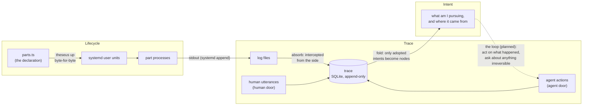

<p align="center">
  
</p>

<h1 align="center">Theseus V2</h1>

<p align="center">
  A personal AI operating system, rebuilt top-down: declarative process lifecycle, an append-only causal trace, and an intent tree derived from what actually happened.
</p>

<p align="center">
  <a href="LICENSE"></a>
  = 22.18" src="https://img.shields.io/badge/node-%3E%3D%2022.18-brightgreen">
  
  
</p>

<p align="center">
  English | <a href="README.zh-CN.md">中文</a>
</p>

---

Like the ship of Theseus, this system is designed to be rebuilt plank by plank while it sails: parts get replaced, corrected, and grown at runtime, while three questions stay answerable at any moment — **what am I pursuing, what happened, and why**.

> **Note:** the requirements, design, and acceptance documents under `docs/` are written in Chinese, the working language of this project. This README is the English entry point.

## Features

- **Declarative lifecycle on systemd** — `parts.ts` is the single source of truth. Unit files are derived from it byte-for-byte; `up` / `down` / `status` are idempotent; drift is reported in both directions (installed but undeclared, declared but missing). Dependency cycles and dangling references are rejected with the full chain named.
- **Honest state reporting** — each of systemd's six `ActiveState` values has an explicit translation (`activating` is *starting*, never *running*). Unrecognized states surface with the raw word instead of falling into a default, and "unit not installed" is its own state rather than *stopped*.
- **Append-only causal trace on SQLite** — every step records who did it (`namespace:type:session`), what caused it, or which of three recognized origins it came from (`you-said` / `clock-fired` / `arrived-from-outside`). IDs are monotonic ULIDs, so a single `CHECK (cause < id)` makes causal cycles structurally impossible.
- **Decisions carry their grounds** — `decision.*` and `self.*` records are refused without a `basis`; conclusions resting entirely on routine bookkeeping are refused as well.
- **Compaction that downsamples, never deletes** — old routine records fold into daily counts; anything referenced by a cause or basis stays put, and causal chains replay intact afterwards.
- **An intent tree that is a query, not a table** — the tree is folded out of the trace on every read; there is no second store to drift. Only intents backed by a direct human utterance become nodes; agent proposals never do. Corrections replace a node's current wording while the original stays in place, retrievable later as (guess, fix) pairs.
- **Two doors** — human-facing entry points may write human-attributed records; the agent-facing door refuses them outright, so the authority criterion cannot be forged from the reachable surface.
- **Mutation-locked test suite** — a harness deliberately breaks each load-bearing property and verifies its test goes red. A test that stays green under mutation is reported as decoration.
- **Zero runtime dependencies** — Node's built-in `node:sqlite`, systemd, and TypeScript executed directly by Node. The only packages are `typescript` and `@types/node`, both dev-only.

## Architecture



## Project status

| Module | Scope | Use cases | Status |
|---|---|---|---|
| **Lifecycle** | Process start/stop, honest state, two-way drift reconciliation | U1–U6 | ✅ Implemented + accepted |
| **Trace** | Causal chains, three origins, decisions with grounds | U7–U14 | ✅ Implemented + accepted (migration round U13/U14 pending) |
| **Intent tree** | What I'm pursuing and where it came from, folded from the trace | U15–U19 | ✅ Implemented + accepted |
| **Loop** | Event → something notices → action → new trace | U20–U24 | 📋 Requirements written (with failure scenarios) |

Each module moves through the same pipeline: requirements (no technical vocabulary allowed) → design (citing the prior art each choice borrows from) → acceptance spec (asserting the user's situation, not the mechanism's state) → implementation → mutation lock.

Current test tally: **121 tests passing, 41/41 mutations turn their target test red**.

## Getting started

### Prerequisites

- Linux with a running systemd **user** instance
- [Node.js](https://nodejs.org) ≥ 22.18 (runs TypeScript directly and ships `node:sqlite`)
- [pnpm](https://pnpm.io)

### Installation

```bash
git clone https://github.com/sephirxth/TheseusV2.git
cd TheseusV2
pnpm install
```

### Usage

Declare your parts in `parts.ts` — everything else is derived from it:

```ts
export const parts: readonly Part[] = [
  { name: 'bridge',  needs: [],         command: 'exec node bridge.js' },
  { name: 'watcher', needs: ['bridge'], command: 'exec node watcher.js',
    ready: 'curl -sf localhost:7700/health' },   // optional readiness probe
];
```

```bash
node src/cli.ts up        # reach the declared state (idempotent; no rollback — fix and rerun)
node src/cli.ts status    # honest per-part state plus drift in both directions
node src/cli.ts down      # stop (based on what systemd holds, not what is on disk)
```

### Testing

```bash
pnpm typecheck    # tsc --noEmit, strict everything
pnpm test         # unit + acceptance (acceptance uses public entry points only)
pnpm mutate       # mutation lock: break each property, expect its test to go red
```

One acceptance test (U9-3) measures the routine-record ratio against a real ledger from the previous system; point `THESEUS_OLD_LEDGER` at it, or that test reports itself unmeasurable rather than passing quietly.

## Project structure

```
parts.ts                  The declaration. This file is the truth; the rest is derived
src/
  theseus.ts              up / down / status, dependency precheck, two-way reconciliation
  unit.ts, state.ts       Part → unit-file translation; the ActiveState translation table
  systemctl.ts, lock.ts   The only systemctl channel; O_EXCL file lock
  trace.ts, routine.ts    The trace: its single write gate + which types count as routine
  doors.ts                Human door / agent door: agents cannot write human-attributed records
  intent.ts               Intent tree: fold, authority criterion, markers, dangling list
  cli.ts                  A second adapter over the same three verbs; no behavior lives here
docs/
  PRINCIPLES.md           The proven-solutions principle and the four times it won
  requirements/           What a person needs (no technical vocabulary)
  design/                 The means chosen, whose prior art each one borrows, ★ on inventions
  acceptance/             How we know it is delivered (red matters more than green)
  TODO.md                 Upcoming work
test/
  *.test.ts               Unit tests
  acceptance/*.test.ts    Acceptance: assertions phrased in the spec's own words
  mutation-lock.mjs       Tests of the tests: a test that never goes red is decoration
```

## Design philosophy

Reach for a proven solution; invent only where this system is genuinely novel ([`docs/PRINCIPLES.md`](docs/PRINCIPLES.md)). Four times this principle replaced an invention with someone else's answer, and each swap made whole categories of requirements disappear:

| Problem | The invented approach | The proven answer | Outcome |
|---|---|---|---|
| Process lifecycle | A 564-line supervisor | **systemd** | 298 lines; the six hardest requirements vanished instead of being solved |
| Concurrent commands | An in-memory epoch guard | **File lock** (`O_EXCL` on tmpfs, as dpkg and git do) | Works across processes, strictly stronger |
| Cleaning up strays | Delete by name prefix | **Terraform/Kubernetes answer**: delete only what carries our marker | "Deleting the old system too" became impossible by construction |
| Trace storage | A homegrown file format | **SQLite** | Durability, dedup, recursive causal queries, and indexes all come built in |

The self-built pieces are individually flagged (★) in the design docs and watched separately — they are the most expensive and error-prone parts of the system.

## Roadmap

- **Loop (U20–U24)** — design and implementation: closing event → notice → act → trace, with an ask-me gate on irreversible actions and self-feeding protection.
- **Ledger migration (U13)** — importing the old system's 149k-record ledger through the new gates.
- **Cross-agent trace (U14)** — several agents writing one trace.
- **Hermes Memory Provider bridge** — exposing the layered memory over a standard interface (`docs/TODO.md`).

## License

[PolyForm Noncommercial 1.0.0](LICENSE) — free for noncommercial use (personal projects, research, education, noncommercial organizations). **Commercial use requires a separate license**: contact sephirxth@gmail.com.

## Acknowledgments

The trace and intent-tree designs borrow heavily from DeepSeek Harness's goal/authority model and Agent Note lifecycle; every borrowed choice is credited in the design documents, and every invention is flagged with a ★.
