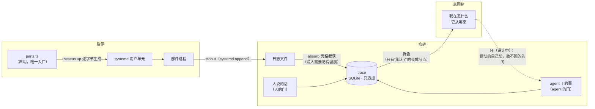

<p align="center">
  
</p>

<h1 align="center">Theseus V2</h1>

<p align="center">
  一个人的 AI 操作系统，自顶向下重建：声明式进程启停、只追加的因果痕迹、从痕迹里折叠出来的意图树。
</p>

<p align="center">
  <a href="LICENSE"></a>
  = 22.18" src="https://img.shields.io/badge/node-%3E%3D%2022.18-brightgreen">
  
  
</p>

<p align="center">
  <a href="README.md">English</a> | 中文
</p>

---

如同忒修斯之船：板子在航行中一块块换掉，而船始终是那条船——系统在运行中被替换、被修正、被长出新的部分，而三个问题在任何时刻都答得上来：**我在追什么、发生过什么、为什么**。

> **说明**：`docs/` 下的需求、设计与验收文档以中文写成，是本项目的工作语言；README 提供中英两个入口。

## 特性

- **基于 systemd 的声明式启停** —— `parts.ts` 是唯一事实来源，unit 文件由它逐字节推导；`up` / `down` / `status` 幂等；漂移双向上报（装了没声明、声明了没装）；依赖成环与悬空在动手之前被拒，并点名整条链。
- **不撒谎的状态** —— systemd 六种 `ActiveState` 逐个显式翻译（`activating` 是 *starting*，不是 *running*）；认不出的状态携带原文上报，不落进默认分支；"未安装"是独立状态，不冒充 *stopped*。
- **只追加的 SQLite 因果痕迹** —— 每一步记下谁干的（`namespace:type:session`）、上一步是哪条，或三种起点之一（`you-said` / `clock-fired` / `arrived-from-outside`）；ID 是单调 ULID，一句 `CHECK (cause < id)` 让因果成环在结构上不可能。
- **决定必须带依据** —— `decision.*` / `self.*` 不带 `basis` 当场被拒；依据全是例行公事的结论同样被拒。
- **清理是降采样，不是删除** —— 旧的例行记录折叠成按天计数；被 cause 或 basis 指着的一条不动，折叠后因果链原样重放。
- **意图树是一次查询，不是一张表** —— 每次读取都从痕迹现场折叠，没有第二份存储可漂移；只有直接挂在人话上的意图长成节点，agent 的提议一条也不长；修正替换节点的当前说法，原话原地保留，之后可按（猜、纠）成对取回。
- **两道门** —— 面向人的入口可以写人类署名的记录；面向 agent 的门直接拒绝，权限判据无法从可及入口伪造。
- **变异锁测试** —— 专门的 harness 故意弄坏每条关键性质，验证对应测试真的变红；变异后仍绿的测试被判为装饰品。
- **零运行时依赖** —— Node 内建 `node:sqlite` + systemd + Node 直接执行 TypeScript；仅有的两个包 `typescript`、`@types/node` 都是 dev 依赖。

## 架构



## 项目状态

| 模块 | 职责 | 用例 | 状态 |
|---|---|---|---|
| **启停** (lifecycle) | 部件进程的生死、诚实状态、双向对账 | U1–U6 | ✅ 实现 + 验收 |
| **痕迹** (trace) | 因果链、三种起点、决定带依据 | U7–U14 | ✅ 实现 + 验收（U13/U14 迁移轮待做） |
| **意图树** (intent) | 我在追什么、它从哪来，从痕迹折叠 | U15–U19 | ✅ 实现 + 验收 |
| **环** (loop) | 发生 → 有东西看见 → 动手 → 又留痕 | U20–U24 | 📋 需求已定（含反面场景） |
| **桥** (bridge) | 切换的体验：交付一句就走、切回一眼接上、谁在等我一目了然 | U25–U29 | 📋 需求已定（含反面场景） |
| **画布** (canvas) | 第二入口：摆到一起就是思考、布局归人、真相单源、看见即可动手 | U30–U34 | 🔨 v0.1 已可用（`canvas/`），直接迭代 |

每个模块走同一条流水线：需求（不出现技术名词）→ 设计（写明每处借用了谁的成熟做法）→ 验收规格（断言人的处境，不是机制的状态）→ 实现 → 变异锁。

当前测试计数：**121 条全绿，41/41 个变异让对应测试变红**。

## 快速开始

### 环境要求

- Linux，带运行中的 systemd **用户**实例
- [Node.js](https://nodejs.org) ≥ 22.18（直接执行 TypeScript，内建 `node:sqlite`）
- [pnpm](https://pnpm.io)

### 安装

```bash
git clone https://github.com/sephirxth/TheseusV2.git
cd TheseusV2
pnpm install
```

### 使用

在 `parts.ts` 里声明部件——其余一切由它推导：

```ts
export const parts: readonly Part[] = [
  { name: 'bridge',  needs: [],         command: 'exec node bridge.js' },
  { name: 'watcher', needs: ['bridge'], command: 'exec node watcher.js',
    ready: 'curl -sf localhost:7700/health' },   // 可选：就绪探针
];
```

```bash
node src/cli.ts up        # 到达声明的状态（幂等；失败不回滚，修好再 up）
node src/cli.ts status    # 逐部件诚实状态 + 双向漂移
node src/cli.ts down      # 停下（以 systemd 持有的为准，不是磁盘上的）
```

### 测试

```bash
pnpm typecheck    # tsc --noEmit，strict 全开
pnpm test         # 单元 + 验收（验收只走公开入口）
pnpm mutate       # 变异锁：弄坏每条性质，期望对应测试变红
```

有一条验收（U9-3）要拿旧系统的真实账本量例行记录占比：用 `THESEUS_OLD_LEDGER` 指定路径；量不到就报量不到，不静默通过。

## 目录结构

```
parts.ts                  声明。这个文件是真相，其余都是推导
src/
  theseus.ts              up / down / status，依赖预检，双向对账
  unit.ts, state.ts       Part → unit 文件的逐字节翻译；状态翻译表
  systemctl.ts, lock.ts   唯一的 systemctl 通道；O_EXCL 文件锁
  trace.ts, routine.ts    痕迹：唯一写入门 + 哪些类型算例行公事
  doors.ts                人的门 / agent 的门：agent 写不出人类署名的记录
  intent.ts               意图树：折叠、判据、记号、悬着的名单
  cli.ts                  同三个动词的第二个适配器，没有行为
docs/
  PRINCIPLES.md           成熟解法原则与它赢过的四次
  requirements/           人要什么（不出现技术名词）
  design/                 用什么手段、借用了谁，自己造的标 ★
  acceptance/             怎么知道真的兑现了（红比绿更重要）
  TODO.md                 后续工作
test/
  *.test.ts               单元测试
  acceptance/*.test.ts    验收：断言照抄规格措辞
  mutation-lock.mjs       测试的测试：不会红的测试是装饰品
```

## 设计哲学

第一原则：先找成熟解法，再考虑自己造（[`docs/PRINCIPLES.md`](docs/PRINCIPLES.md)）。这条原则四次用别人的答案换掉了自己的发明，每次都让一批需求直接消失：

| 问题 | 一开始想自己造 | 换成谁的做法 | 结果 |
|---|---|---|---|
| 进程生死 | 564 行看护程序 | **systemd** | 缩到 298 行，第 1 版最难的六条需求消失而非被解决 |
| 并发命令 | 内存版本号护栏 | **文件锁**（`O_EXCL` + tmpfs，dpkg/git 的做法） | 跨进程真正有效，严格更强 |
| 清理多余物 | 按名字前缀删 | **Terraform/K8s 的答案**：只删带自家记号的 | "连旧系统一起删掉"从构造上不可能 |
| 痕迹存储 | 自定文件格式 | **SQLite** | 持久、去重、递归因果查询、索引全部现成 |

自己造的部分在设计文档里逐处标 ★、单独盯防——它们是系统里最贵、最容易错的部分。

## 路线图

- **桥（U25–U29）** —— 设计与实现：让多机多窗的工作形态过得下去——交付零手续、切回一眼接上、注意力照单不巡逻、隔窗把话放到别的线上、摊着的线数得过来。
- **环（U20–U24）** —— 设计与实现：闭上「发生 → 看见 → 动手 → 留痕」，该动的自己动，撤不回的先问。
- **画布（U30–U34）** —— 需求已定（认领自作者 2021 年的 PKM 需求书与当年真实动手的白板原型）；设计与实现排在桥之后。"两个入口结果必须一致"从这里进验收。
- **旧账本迁移（U13）** —— 把旧系统 14.9 万条账本按新门的规矩接进来。
- **跨 agent 痕迹（U14）** —— 多个 agent 写同一份痕迹。
- **Hermes Memory Provider 桥接** —— 以标准接口暴露分层记忆（`docs/TODO.md`）。

## 许可证

[MIT License](LICENSE) —— 非商业用途免费（个人项目、研究、教育、公益组织）。**商业使用需另行授权**：联系 sephirxth@gmail.com。

## 致谢

痕迹与意图树的设计大量借鉴 DeepSeek Harness 的 goal/authority 模型与 Agent Note 生命周期；每一处借用都在设计文档里注明出处，每一处自造都标了 ★。
